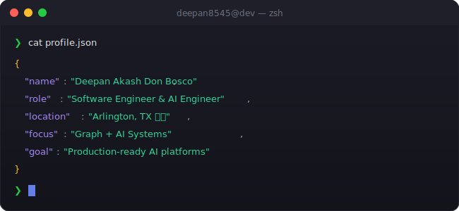

<!-- 
╔══════════════════════════════════════════════════════════════════════════════╗
║                                                                              ║
║   ██████╗ ███████╗██████╗  ██████╗ ██╗   ██╗ █████╗ ███╗   ██╗██╗   ██╗██╗   ║
║   ██╔══██╗██╔════╝██╔══██╗██╔═══██╗╚██╗ ██╔╝██╔══██╗████╗  ██║██║   ██║██║   ║
║   ██████╔╝█████╗  ██║  ██║██║   ██║ ╚████╔╝ ███████║██╔██╗ ██║██║   ██║██║   ║
║   ██╔══██╗██╔══╝  ██║  ██║██║   ██║  ╚██╔╝  ██╔══██║██║╚██╗██║██║   ██║██║   ║
║   ██║  ██║███████╗██████╔╝╚██████╔╝   ██║   ██║  ██║██║ ╚████║╚██████╔╝███████╗
║   ╚═╝  ╚═╝╚══════╝╚═════╝  ╚═════╝    ╚═╝   ╚═╝  ╚═╝╚═╝  ╚═══╝ ╚═════╝ ╚══════╝
║                                                                              ║
║      🚀 SOFTWARE ENGINEER • AI ENGINEER • MLOPS / DEVOPS • PROBLEM SOLVER 🚀      ║
║                                                                              ║
╚══════════════════════════════════════════════════════════════════════════════╝
-->

<div align="center">
  
  <!-- ═══════════════════════════════════════════════════════════════════════════ -->
  <!-- 🎯 ANIMATED HEADER                                                          -->
  <!-- ═══════════════════════════════════════════════════════════════════════════ -->
  
  
  
  <br/>
  
  <!-- ═══════════════════════════════════════════════════════════════════════════ -->
  <!-- 📊 PROFILE BADGES                                                           -->
  <!-- ═══════════════════════════════════════════════════════════════════════════ -->
  
  <a href="https://github.com/deepan8545">
    
  </a>
  &nbsp;
  <a href="https://github.com/deepan8545?tab=repositories">
    
  </a>
  &nbsp;
  <a href="https://github.com/deepan8545?tab=followers">
    
  </a>
  &nbsp;
  <a href="https://github.com/deepan8545">
    
  </a>
  
</div>

<br/>

<!-- ═══════════════════════════════════════════════════════════════════════════ -->
<!-- 🖥️ TERMINAL INTRO SECTION                                                   -->
<!-- ═══════════════════════════════════════════════════════════════════════════ -->

<div align="center">
  
</div>

<br/>


<br/>

<!-- ═══════════════════════════════════════════════════════════════════════════ -->
<!-- 👤 ABOUT ME SECTION                                                          -->
<!-- ═══════════════════════════════════════════════════════════════════════════ -->


<br/><br/>

<table>
<tr>
<td width="55%" valign="top">

### 🎯 What I Do

```yaml
name: Deepan Akash Don Bosco
located_in: Arlington, TX 🇺🇸
current_role: Software Engineer / AI Engineer
experience: 5+ years (Software • MLOps • DevOps • AI)

specialties:
  - 🤖 AI Engineering (NLP, CV, GenAI)
  - 🧠 Knowledge Graphs (Neo4j, Cypher)
  - ⚙️ MLOps & Observability (MLflow, Prometheus, Grafana, ELK)
  - ☁️ Cloud-Native Systems (AWS, Docker, Kubernetes)
  - 🌐 Full-Stack (React, Node.js)

currently_building:
  - Privacy-first AI memory systems
  - Neo4j-backed AI APIs & semantic retrieval
  - Automation pipelines for production ML
```

</td>
<td width="45%" valign="top">

### 🚀 Current Focus

- 🧠 **Building** scalable, production-ready AI systems
- 🕸️ **Designing** graph-powered AI (Neo4j knowledge graphs)
- ☁️ **Shipping** cloud-native pipelines on AWS
- 📈 **Improving** reliability with monitoring + automation

<br/>

### 💡 Quick Facts

- ✅ AWS Certified Solutions Architect – Associate
- 📚 M.S. Information Systems (UTA)
- 🔥 Obsessed with automation & clean system design

</td>
</tr>
</table>

<br/>


<br/>

<!-- ═══════════════════════════════════════════════════════════════════════════ -->
<!-- 🏆 ACHIEVEMENTS SECTION                                                     -->
<!-- ═══════════════════════════════════════════════════════════════════════════ -->


<br/><br/>

<div align="center">
  
  <!-- GitHub Trophies -->
  <a href="https://github.com/ryo-ma/github-profile-trophy">
    
  </a>
  
</div>

<br/>


<br/>

<!-- ═══════════════════════════════════════════════════════════════════════════ -->
<!-- 📊 GITHUB ANALYTICS                                                         -->
<!-- ═══════════════════════════════════════════════════════════════════════════ -->


<br/><br/>

<div align="center">
  
  <!-- GitHub Stats + Custom Streak in ONE ROW -->
  <a href="https://github.com/deepan8545">
    
  </a>
  &nbsp;
  <a href="https://github.com/deepan8545">
    
  </a>
  
  <br/><br/>
  
  <!-- 📊 REAL-TIME LANGUAGE USAGE WITH PROGRESS BARS -->
  <a href="https://github.com/deepan8545">
    
  </a>
  
  <br/><br/>
  
  <!-- Activity Graph -->
  <a href="https://github.com/deepan8545">
    
  </a>
  
  <br/><br/>
  
  <!-- Additional Stats Cards -->
  
  
</div>

<br/>


<br/>

<!-- ═══════════════════════════════════════════════════════════════════════════ -->
<!-- 🎮 CONTRIBUTION SHOWCASE                                                    -->
<!-- ═══════════════════════════════════════════════════════════════════════════ -->


<br/><br/>

<div align="center">
  
  <!-- Pac-Man Contribution Graph -->
  <picture>
    <source media="(prefers-color-scheme: dark)" srcset="./assets/pacman-contribution-graph-dark.svg"/>
    <source media="(prefers-color-scheme: light)" srcset="./assets/pacman-contribution-graph.svg"/>
    
  </picture>
  
  <br/>
  
  <sub>👾 Watch Pac-Man devour my contributions!</sub>
  
</div>

<br/>


<br/>

<!-- ═══════════════════════════════════════════════════════════════════════════ -->
<!-- ⚡ TECH STACK                                                               -->
<!-- ═══════════════════════════════════════════════════════════════════════════ -->


<br/><br/>

<div align="center">

<!-- 💻 LANGUAGES -->
<h4>💻 Languages</h4>
<p>
  <a href="https://www.python.org/" target="_blank"></a>
  <a href="https://developer.mozilla.org/en-US/docs/Web/JavaScript" target="_blank"></a>
  <a href="https://www.typescriptlang.org/" target="_blank"></a>
  <a href="https://isocpp.org/" target="_blank"></a>
  <a href="https://en.wikipedia.org/wiki/C_(programming_language)" target="_blank"></a>
  <a href="https://kotlinlang.org/" target="_blank"></a>
  <a href="https://www.gnu.org/software/bash/" target="_blank"></a>
</p>

<!-- 🤖 AI & MACHINE LEARNING -->
<h4>🤖 AI & Machine Learning</h4>
<p>
  <a href="https://www.tensorflow.org/" target="_blank"></a>
  <a href="https://pytorch.org/" target="_blank"></a>
  <a href="https://opencv.org/" target="_blank"></a>
  <a href="https://scikit-learn.org/" target="_blank"></a>
</p>

<!-- 🌐 WEB DEVELOPMENT -->
<h4>🌐 Web Development</h4>
<p>
  <a href="https://reactjs.org/" target="_blank"></a>
  <a href="https://nextjs.org/" target="_blank"></a>
  <a href="https://nodejs.org/" target="_blank"></a>
  <a href="https://www.djangoproject.com/" target="_blank"></a>
  <a href="https://flask.palletsprojects.com/" target="_blank"></a>
  <a href="https://tailwindcss.com/" target="_blank"></a>
  <a href="https://developer.mozilla.org/en-US/docs/Web/HTML" target="_blank"></a>
  <a href="https://developer.mozilla.org/en-US/docs/Web/CSS" target="_blank"></a>
</p>

<!-- 🗄️ DATABASES -->
<h4>🗄️ Databases</h4>
<p>
  <a href="https://www.mongodb.com/" target="_blank"></a>
  <a href="https://www.postgresql.org/" target="_blank"></a>
  <a href="https://www.mysql.com/" target="_blank"></a>
  <a href="https://redis.io/" target="_blank"></a>
  <a href="https://firebase.google.com/" target="_blank"></a>
  <a href="https://www.sqlite.org/" target="_blank"></a>
</p>

<!-- 🔧 TOOLS & PLATFORMS -->
<h4>🔧 Tools & Platforms</h4>
<p>
  <a href="https://git-scm.com/" target="_blank"></a>
  <a href="https://www.docker.com/" target="_blank"></a>
  <a href="https://www.linux.org/" target="_blank"></a>
  <a href="https://code.visualstudio.com/" target="_blank"></a>
  <a href="https://azure.microsoft.com/" target="_blank"></a>
  <a href="https://vercel.com/" target="_blank"></a>
  <a href="https://www.figma.com/" target="_blank"></a>
  <a href="https://www.postman.com/" target="_blank"></a>
</p>

</div>

<br/>


<br/>

<!-- ═══════════════════════════════════════════════════════════════════════════ -->
<!-- 🔥 CURRENTLY WORKING ON                                                     -->
<!-- ═══════════════════════════════════════════════════════════════════════════ -->

<div align="center">
  
### ⚡ Currently Building & Learning

<br/>

<a href="https://github.com/deepan8545">
  
</a>
&nbsp;
<a href="https://github.com/deepan8545">
  
</a>
&nbsp;
<a href="https://github.com/deepan8545">
  
</a>

</div>

<br/>


<br/>

<!-- ═══════════════════════════════════════════════════════════════════════════ -->
<!-- 🌐 CONNECT WITH ME                                                          -->
<!-- ═══════════════════════════════════════════════════════════════════════════ -->


<br/><br/>

<div align="center">
  
<a href="https://github.com/deepan8545" target="_blank">
  
</a>
&nbsp;
<!-- Update your LinkedIn URL if different -->
<a href="https://linkedin.com/in/deepan8545" target="_blank">
  
</a>

</div>

<br/>


<br/>

<!-- ═══════════════════════════════════════════════════════════════════════════ -->
<!-- 💡 RANDOM DEV QUOTE                                                         -->
<!-- ═══════════════════════════════════════════════════════════════════════════ -->

<div align="center">
  
### 💭 Random Dev Quote

<br/>

<a href="https://github.com/deepan8545">
  
</a>

</div>

<br/>

<!-- ═══════════════════════════════════════════════════════════════════════════ -->
<!-- 🌟 FOOTER                                                                   -->
<!-- ═══════════════════════════════════════════════════════════════════════════ -->

<div align="center">
  
  
  
  <br/>
  <br/><br/>
  
  
  
</div>

<!-- ═══════════════════════════════════════════════════════════════════════════ -->
<!-- 📝 END OF README                                                            -->
<!-- ═══════════════════════════════════════════════════════════════════════════ -->
